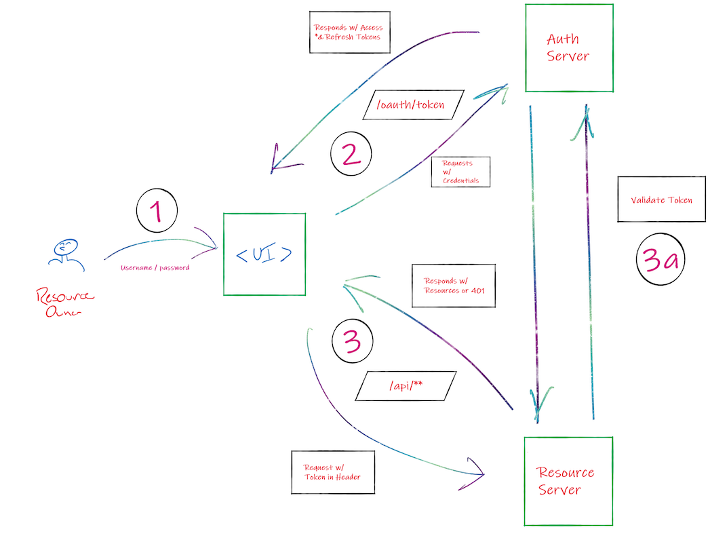

# Intro To Security

As web developers, security is not just a nice-to-have: it is an ***imperative***.

When data on users drives so much we do, it's our job ensure their information is safe.

Additionally, we must ensure that a user's information can't be used to penetrate our application in order to perform nefarious actions.

There are two parts to securing an application:

####Authentication and Authorization

And we have a fantastic way of implementing that security!

---
## OAuth 2.0

There are many ways to secure applications.
One of the airtight methods is to use the **OAuth 2.0** specification.

In the future, you may find yourself using more complex mechanisms for implementing OAuth, 
but here is a breakdown of the parts which make our security environment:

### 1. Resource Owner

The actual user wanting access to protected endpoints. They must be an *existing* user in the system.

The user passes their credentials (email or username / password) to the *authorization server* in order to be authenticated to make requests to the *resource server*.

### 2. Authorization Server 

Issues access and refresh *tokens* based on authentication/authorization of Resource Owner.

Those tokens will be used to validate requests to our *resource server*.

### 3. Resource Server

The realm which serves up our actual content on protected endpoints (`/api`, in our case).

It uses the ***token*** found in the request header to verify the resource request.

###From a registered user's perspective, here's what the flow would look like:

This particular flow is called **Password Grant**. 

Password Grant is not what we would typically use in the industry, *however* it is a great first introduction into implementing OAuth 2.0

**In the next few lessons, we will set up the infrastructure for OAuth 2.0 in our application.**

## Next Up: [Implementing OAuth 2.0](19-implementing-oauth.md)

