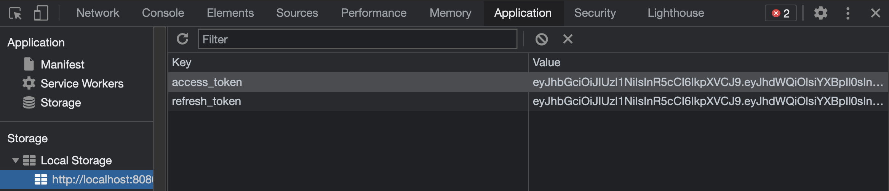

# Testing with OAuth 2.0

Now that we have the core security pieces in place, 
we will need to take a look at:

- The process of creating an `Access Token` / `Refresh Token`

- What the token looks like after it is decrypted.

- How is that token stored with the client.

- How to send it back to the server when making a request.

---

### Of Note: From this point, we will be doing much of our testing using the Client-Side App or Fetch API within the browser console.

---
## TODO: Create the Access and Refresh Tokens

In order to authenticate a `User` with our server, the `User` must actually exist and be given a role.

1. After starting your application, navigate to `/login` in the browser.

2. Login with an existing user.

3. Open `Inspect -> Application -> Storage - Local Storage -> http://localhost:8080 `

4. If your auth request was successful, you will see two tokens:

5. Copy the `access_token` value and navigate to [jwt.io](https://jwt.io/)
    - Scroll down paste your token in the `Encoded` box:
    

6. Looking at the decoded JWT (JSON Web Token), what do you notice?
    - Compare these values to what you see in `OAuthConfiguration`

---

## TODO: Test Your Endpoints

Now, it's time to ensure your user has access to the endpoints they need.

**More importantly**, let's verify that unauthenticated users can't access secured endpoints as well as seeing that users without proper authorization can't perform *unauthorized* operations:

- [x] Unauthenticated user cannot edit posts
- [x] Unauthenticated user cannot delete posts

- [x] Authenticated user with USER role can **view** all posts
- [x] Authenticated user with USER role can **create** posts
- [x] Authenticated user with USER role can **edit their** posts
- [x] Authenticated user with USER role can **delete their** posts

- [x] Authenticated **ADMIN** user can perform any operation on any posts

## Next Up: [Using Auth as a Resource](21-using-auth-as-resource.md)

